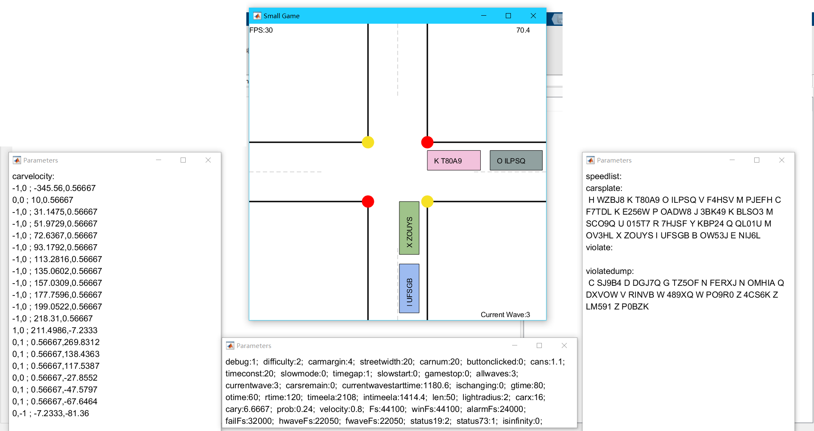
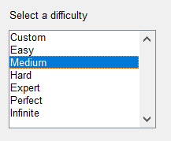

# Project 1

## Contents

- [Features of the game](#features-of-the-game)
- [How to run this game in different modes](#how-to-run-this-game-in-different-modes)
  * [Run the game in normal mode](#run-the-game-in-normal-mode)
  * [Run the game in debug mode](#run-the-game-in-debug-mode)
- [How do I choose game mode](#how-do-i-choose-game-mode)
  * [Game parameters](#game-parameters)
  * [Custom mode](#custom-mode)
  * [Infinite mode](#infinite-mode)
  * [Suggestions for new players](#suggestions-for-new-players)
- [What's the target of the game](#what-s-the-target-of-the-game)
- [Skills in the game](#skills-in-the-game)
  * [Dash](#dash)
  * [Focus](#focus)
  * [Combination](#combination)
- [Details about source code](#details-about-source-code)
  * [.m file function](#m-file-function)
  * [Explanation of variables in class dataHandle](#explanation-of-variables-in-class-datahandle)
- [Resources](#resources)

Project 1 is a MATLAB-based car simulation game.

## Features of the game

- Interactive
- Simple setting
- Skills can be used to beat this game
- Background music and sound effects
- Traffic light controlling system
- Time controlling system
- Plates on the cars
- In-game timer supported
- Different game modes
- Customizable
- Open source
- Different length, color of cars

## How to run this game in different modes

### Run the game in normal mode

Run `main.m` under the root folder. 

**WARNING:** This game has music and sound effects.

Then you can see a small window which lets you choose different modes. Mode selection will be explained in next section.

### Run the game in debug mode

Edit `dataHandle.m` file and change `debug=0;` (line 3) to `debug=1;`. Then run `main.m`.

**WARNING:** This is only for debugging, not for players to play with.

In debug mode, you will see three windows beside the main one:

The left one shows the velocity vector, position of all the cars which have been loaded to the map; the bottom one shows all parameters of the game; the right one shows some dynamic matrix of the game.

Debug mode helps me fix my bug effectively.

## How do I choose game mode

There are seven game modes designed in my game.

They have different parameters and small differences, so first I will first explain them.

### Game parameters

There are 8 main parameters which different game modes define differently:

| *Mode\Para*  | Carnum   | Gtime  | Otime  | Rtime  | Prob   | Vel    | Carm   | Dif    |
| ------------ | -------- | ------ | ------ | ------ | ------ | ------ | ------ | ------ |
| **Custom**   | Custom   | Custom | Custom | Custom | Custom | Custom | Custom | Custom |
| **Easy**     | 40       | 4      | 4      | 7      | 0      | 0.6    | 5      | 5      |
| **Medium**   | 60       | 4      | 3      | 6      | 0.2    | 0.6    | 4      | 5      |
| **Hard**     | 70       | 4      | 2.5    | 6      | 0.5    | 0.8    | 3      | 7      |
| **Expert**   | 100      | 4      | 2      | 6      | 0.7    | 0.9    | 3      | 8      |
| **Perfect**  | 150      | 4      | 2      | 6      | 0.9    | 1      | 3      | 10     |
| **Infinite** | Infinity | 4      | 3      | 6      | 0.2    | 0.8    | 3      | 5      |

Detailed information about each (main) parameter is given below:

- carnum: Total number of cars. Must >=4.
- len: Half length of the map width. Default 50(map unit).
- streetwidth: Width of the street. Default 20(map unit).
- gtime: Green light period time. Unit: seconds. 
- otime: Orange(or yellow) light period time. Unit: seconds.
- otime: Ref light period time. Unit seconds.
- prob: Probability that a car crosses the road when the light is orange or red. (Note that this variable is changing through the whole game because after many waves you should have a higher probability which means harder. But this has a upper bound)
- velocity: Global velocity (for moving objects). Unit: map unit/frame.(also changeable)
- carmargin: Distance between two adjacent cars. Unit: map unit, default 3.
- difficulty: A parameter which affects the average car length. Higher means longer car length. (changeable)

### Custom mode

In this mode, you can choose your own parameters given above(in the table). This can be useful while debugging. Don't try to set unrealistic parameters, this can only lead to disaster on your computer.

### Infinite mode

In this mode, you will deal with infinite numbers of cars which come by infinite waves. You can see your current wave number on the lower right corner of the window.

### Suggestions for new players

This game is hard for it's precise control of many cars, so you won't play hard mode when you first try this game. Please play the game in order from easy to perfect.

## What's the target of the game

The target of this game is to let every car pass the cross without crash. You may break law of traffic, but at the end of the game, it will show how many cars violate the rule.

Easy as it may sound, this game is quite hard. Cars may no stop at the crossroad so you must let them pass the cross ahead of time.

## Skills in the game

There are only two skills in this game.

### Dash

You can accelerate a car by **left-click on the car**. But it will return to it's original speed after a few frames.

However, you can use multiple clicks to gain more speed and more speedup time.

| Number of clicks | Speed(Normal=1) | Time |
| ---------------- | --------------- | ---- |
| 1                | 2.5             | 7    |
| 2                | 3.75            | 17   |
| 3                | 5.625           | 27   |
| 4                | 8.4375          | 37   |
| ...              | ...             | ...  |

Note that if you use dash and you are running a red or orange light with high speed, you won't stop in any case, but your car will be added to the 'violation list'.

### Focus

You can slow down the time in game by **pressing and holding shift button**. By doing this, you will see the background color becomes yellow, and cars are slowed down. In focus mode, you can move cars effectively by using 'Dash' skill. However, there is a time limit for this. You can only hold shift for 30 frames, about 1 second for each time. You can reuse this skill after the focus mode, and there are no limits on how many times you use this skill.

### Combination

To play the hard, expert or even perfect mode, you have to master these two skills and use dashing while focusing. This can help you move cars quickly. However, you should move your mouse quickly and accurately so that you can let them pass the road more efficiently.

## Details about source code

### .m file function

- dataHandle.m: Define all the variables in a class, ask user to input some parameters to initialize all the variables we needed
- drawStreets.m: Draw streets
- initCarsPosition.m: Initialize all cars position
- judgeEnd.m: Judge if the game should end or should go to the next wave
- debug.m: In debug mode, print variables to the screen
- generatePlates.m: Generate all plates
- initDebug.m: Initialize three windows to show information
- keyboardChange.m: Keyboard trigger(including pressing down and up)
- reGenerateCars.m: After one wave, create another wave
- checkSpeedup.m: Update speedlist in order to control speed-up cars
- detectLight.m: Change light
- getMouse.m: Mouse trigger(dash)
- initDist.m: Initialize car numbers of four roads
- levelSelect.m: Select different levels, there are level parameters set here
- clearCars.m: Clear cars in the map
- doubleTrigger.m: Control triggers like timer, game close playback function, mouse trigger and so on
- ifCanStop.m: Detect if car should stop and record law violated cars
- initPlates.m: Initialize plates position
- main.m: Entrance
- createCars.m: Create cars(for the first time)
- drawPlates.m: Draw plates
- ifHell.m: Judge if two cars crashed
- initWaves.m: Initialize wave numbers
- moveCars.m: Move cars every frame

### Explanation of variables in class dataHandle

| Definition              | Explanation                                                  |
| ----------------------- | ------------------------------------------------------------ |
| debug=0;                | if you want to debug, change this                            |
| debugger;               | debugger for debug use                                       |
| game;                   | game timer                                                   |
| gtimer;                 | ingame timer                                                 |
| deleft=0;               | variables used in debug mode                                 |
| deright=0;              | variables used in debug mode                                 |
| dedown=0;               | variables used in debug mode                                 |
| difficulty=5;           | difficulty                                                   |
| carmargin=3;            | distance between adjacent cars                               |
| streetwidth=0;          | street width                                                 |
| carnum=0;               | number of cars                                               |
| buttonclicked=0;        | flag used to judge if shift is pressed(some PC has problem with keyboard  playback function so I use this to fix them) |
| cans=1.1;               | constant used to define small distance between cars and streets |
| timeconst=20;           | time unit                                                    |
| slowmode=0;             | if it is in slow mode                                        |
| timegap=1;              | time gap                                                     |
| slowstart=0;            | time when slow mode is started                               |
| gamestop=0;             | if game has stopped                                          |
| allwaves=2;             | number of all waves                                          |
| waves=[];               | matrix of waves                                              |
| currentwave=1;          | current wave number                                          |
| currentwavestarttime=0; | current wave start time                                      |
| ischanging=0;           | if now is between waves                                      |
| gtime=0;                | green light time                                             |
| otime=0;                | orange light time                                            |
| rtime=0;                | red light time                                               |
| timeela=0;              | time stamp in the game                                       |
| intimeela=0;            | ingame time stamp                                            |
| len=50;                 | half of the map length                                       |
| lightradius=2;          | light radius                                                 |
| carx=0;                 | the length of the car                                        |
| cary=0;                 | the width of the car                                         |
| carlength=[];           | the set of car length                                        |
| prob=0;                 | probability                                                  |
| velocity=0;             | global velocity                                              |
| yt=0;Fs=0;              | music related                                                |
| winmusic=0;winFs=0;     | music related                                                |
| alarm=0;alarmFs=0;      | music related                                                |
| fail=0;failFs=0;        | music related                                                |
| hwave=0;hwaveFs=0;      | music related                                                |
| fwave=0;fwaveFs=0;      | music related                                                |
| player=0;               | music related                                                |
| light19;                | light handle                                                 |
| light91;                | light handle                                                 |
| light73;                | light handle                                                 |
| light37;                | light handle                                                 |
| carsdist=[];            | car distribution information                                 |
| speedlist=[];           | cars that are dashing                                        |
| violatecars=[];         | violated cars in current wave                                |
| violatecarsdump=[];     | all violated cars                                            |
| allcars=[];             | set of all cars in this wave                                 |
| allcarshandler=[];      | car handle                                                   |
| carsplate=[];           | plate                                                        |
| platehandler=[];        | plate handle                                                 |
| status19=2;             | status of the light                                          |
| status73=0;             | status of the light                                          |
| wavedisplayer=0;        | text that show current wave                                  |
| isinfinity=0;           | if it is infinity mode                                       |

You can find this in `dataHandle.m`.

## Resources

I use music and sound effects from video game 'Plants vs. Zombies'.

--------

Xiang Yiming. 2021.