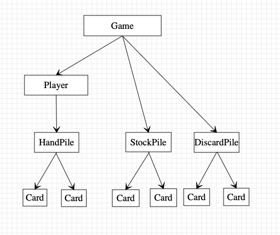

# Introduction

`Onecard` is a local game that almost simulates the popular card game `UNO`. The game `Onecard` have `n` players, `r` rounds and `d` decks of cards to be used. During each round, every player draws `c` cards initially, and ought to draw one card each turn but could be skipped by playing certain cards.

# Build

*   Download the file `p2m3`
*   This project requires 
    *   a `C complier` already defining one of the items listed following:
        *   `_WIN32`
        *   `__APPLE__`
        *   `__linux__`
        *   `__unix__` *(not recommended)*
    *    a `make` executiable item to run the code in the `makefile` file, like:
        *   terminal code `make` in `linux` or `apple`
        *   executiable item `mingw32-make.exe` in `windows`

# Get started

*   Locate the file `p2m3` at any path
*   Prompt `make` in terminal (linux or apple) or `mingw32-make` in command (windows)
*   Run the executiable file `onecard` to start the game
    *   If you run `onecard` in a terminal window, you could prompt more options to modify the upcoming game.
        *   `-h`|`--help `
            *   print the help message
        *   `--log filename`
            *   write the logs in filename (default: onecard.log)
        *   `-n n`|`--player-number=n `
            *   `n` players, n must be larger than $2$ (default: $4$)
        *   `-c c`|`--initial-cards=c `
            *   deal `c` cards per player, `c` must be at least $2$ (default: $5$)
        *   `-d d`|`--decks=d`
            *   use `d` decks $52$ cards each, `d` must be at least $2$ (default: $2$)
        *   `-r r`|`--rounds=r `
            *   play `r` rounds, `r` must be at least $1$ (default: $1$)
        *   `-a`|`--auto`
            *   run in demo mode
        *   `-g `
            *   run in debug mode

# During the Game

*   You could simply follow the suggestions popped up whenever you need to make choices.
*   When the game is running in a demo mode, UI could automatically make choices.

# Data Structure

*   As the picture depicts, the `Card` structure is the unit of data storing the rank and suit of a card in the Data Structure
*   `Pile` structure contains a secondary pointer pointing to cards 「`Card**`」and PileSize, which handles cards in a dynamic array
*   `User` structure contains the basic information of a player and a pointer pointing to a pile 「`Pile*`」
*   `Game` structure contains the basic information of a game and a secondary pointer to players 「`User**`」and two pointers respectively pointing to the stockpile and the discardpile 「`Pile*`」 

# Layers

#### Layer 1. System

*   `Sys.c` and `UIScreen.c`
    *   「`Sys.c`」help the program identify which kind of computer it is running on 
        *   `ClearScreen()` Clear the screen
        *   `PauseScreen(int _thisSecond)` Pause the program to make sure users could grasp every message and make the whole game more vivid
    *   「`UIScreen.c`」manage the output both on the screen and in the log file
        *   `UIPrint(with pause seconds)` and `FPrint(with specific and changable logfile)`

#### Layer 2. Data

*   `Card.c`, `Pile.c` and `User.c`
    *   「`Card.c`」manage `struct _Card` the unit of data;
        *   `InterpretCardName(...),InerpretCardFunction(...)` help output `Card`
        *   `IsCardMatch(...),IsCardEmpty(...),CardOrder(...)` help the upper layers to read `Card` and tell the difference from `Card`s
        *   `CreateNewCard(...)` help `Layer2_2.Pile` to handle with `Pile`
        *   `DisplayCard(...)` call `Layer1.System` to prompt messages to users
        *   `ClearCard(...),DeleteCard(...)` help the upper layers to clear or delete the whole data structure
    *   「`Pile.c`」manage `struct _Pile` the structure organizing `Card`;
        *   `InitializePile(...),CreatePile(...)` call `Layer2_1.Card` to handle with `Pile`
        *   `InsertCardToPile(...),OutputCardFromPile(...),WithdrawCardPile(...)` transfer `Card` between `Pile`s
        *   `DisplayPile(...)` call `Layer1.System and Layer2_1.Card` to prompt messages to users
        *   `EmptyPile(...),DeletePile(...)` help the upper layers to clear or delete the whole data structure
    *   「`User.c`」manage `struct _User` the structure organizing `Pile`;
        *   `InitializePlayer(...)` call `Layer2_2.Pile` to handle with `User`
        *   `CanPlayerPlay(...)` help the upper layers to read `User`
        *   `DrawCardFromPile(...)` deal with User's demands to draw cards
        *   `DisplayPlayer(...)` call `Layer1.System, Layer2_1.Card and Layer2_2.Pile` to prompt messages to users
        *   `DeletePlayer(...)` help the upper layers to clear or delete the whole data structure

#### Layer3. Game

*   ` Game.c` manage `struct _Game` the structure organizing `User`s and `Pile`s;
    *   `InitializeGame(...)` call `Layer2.Data` to handle with `Game`
    *   `IsGameEnd(...)` check if the round is ended
    *   `DeterminDrawCardNumber(...),DetermineNextPlayer(...),ShiftPlayer(...)` proceed the game based on users' choice prompted by `Layer4.Operation`
    *   `StartGame(...)` manage the whole game process
    *   `DisplayGame(...)` display the current status of the game
    *   `DeleteGame(...)` delete the whole data structure

#### Layer4. Operation

*   `Operation.c` manage users' choices **during the game**
    *   `OptInitialize(...)` call `Layer3.Game` to handle with *All*
    *   `OptPlayerDrawCard(...),OptPlayerPlayCard(...)` respond to users' choices
    *   `OptShiftPile(...)` in case the StockPile is empty

#### Layer5. Main

*   `Main.c` manage user's users' choices **to start a game**

# Notice

*   Two functions asked in `p2.pdf` are replaced by other sort of functions
    *   `a function to shuffle decks of cards`
        *   Changed into `a function to random a card from an ordered pile`
    *   `a function to sort decks of cards`
        *   Changed into `a function to insert a card into an ordered pile maintaining the order of pile` 「*Insertion sort*」
*   As in linux, `usleep()` can't be complied; I use `sleep()` instead making the game move less smoothly; **The game is well-behaved in Windows and MacOS, please use proper system to run the game**
*   **You can find a detailed `Changelog.md`**

